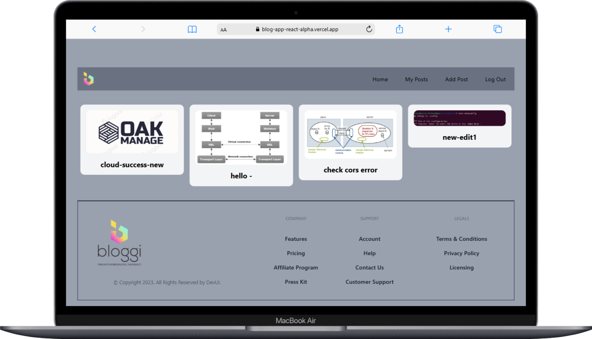
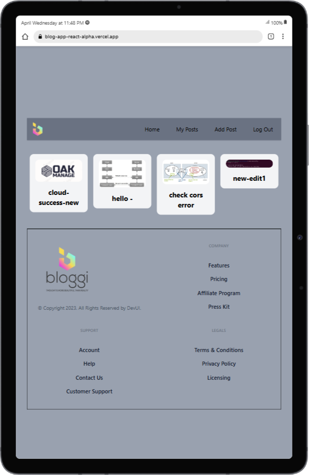

# 📝 Blog App (Powered by Appwrite & React)

Welcome to the **Blog App**, a full-stack blogging platform built with **React**, **Redux**, and **Appwrite** for backend services. This project allows users to **create, edit, delete, and view blog posts**, with authentication and image upload support.

---

## 🚀 Features  
✅ User Authentication (Login, Signup)  
✅ Create, Edit, Delete Blog Posts  
✅ Rich Text Editor (RTE) for Blog Content  
✅ Image Upload via Appwrite Storage  (no more support from appwrite)
    i use cloudinary to create url and that store in app write data base
✅ Responsive Design  
✅ Deployed on **Vercel**

---

## 🛠️ Tech Stack  
- **Frontend:** React, Redux, React Hook Form, TailwindCSS  
- **Backend:** Appwrite (Database, Authentication, Storage)  
- **Deployment:** Vercel  

---







## 📦 Installation  

### 🔹 **1. Clone the Repository**  
```sh
git clone https://github.com/Paradva-Niraj/blog-app-react.git
cd blog-app
npm install
```

### Create a .env file and add your Appwrite credentials:
```sh
EACT_APP_APPWRITE_URL=https://cloud.appwrite.io/v1
REACT_APP_APPWRITE_PROJECT_ID=your_project_id
REACT_APP_APPWRITE_DATABASE_ID=your_database_id
REACT_APP_APPWRITE_COLLECTION_ID=your_collection_id
REACT_APP_APPWRITE_BUCKET_ID=your_bucket_id
```
Start Development Server

👨‍💻 Author<br />
Developed by github.com/Paradva-Niraj<br />
GitHub: @Paradva-Niraj<br />
LinkedIn: www.linkedin.com/in/niraj-paradva/
